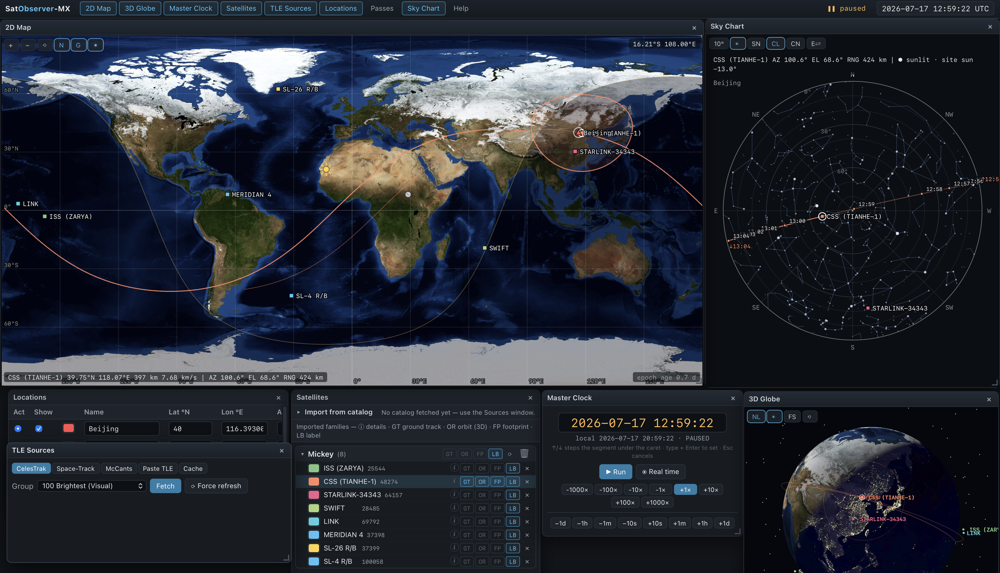

# SatObserver-MX

Satellite tracking and visualization app for macOS, inspired by mic8.ch SatObserver.
Local Python backend (TLE fetching, caching, persistence) + browser frontend
(SGP4 propagation via satellite.js, 2D world map, 3D globe, polar sky chart,
floating windows) — packaged as a standalone native app.



Full development history — requirements → preview → review fixes → iterations →
packaging — is in [DEVLOG.md](DEVLOG.md); module APIs are in [CONTRACT.md](CONTRACT.md).

## Requirements

**Packaged apps** (in `release/`) — no runtime dependencies; Python, imagery,
and star catalog are bundled. Network access is needed for TLE fetching
(cached TLEs work offline). Optional: a free
[space-track.org](https://www.space-track.org) account for Space-Track
queries and batch TLE refresh.

- **macOS** (`SatObserver-MX-macOS-arm64.zip`): Apple Silicon; built and
  tested on macOS 15. Unsigned — first launch on another machine needs
  right-click → Open once.
- **Windows** (`SatObserver-MX-windows-x64.zip`): Windows 10 x64
  (version 1803+) or Windows 11, with the Microsoft Edge **WebView2
  Runtime**. ⚠ The app was developed and tested on **macOS**; the Windows
  package is produced automatically by CI and has **not been tested on real
  Windows hardware** — read [Windows notes & caveats](#windows-notes--caveats)
  before using it.

**To run from source** (browser mode):
- Python ≥ 3.10 — **standard library only**, no packages needed
- Any modern browser (developed against Chrome; the packaged app uses WKWebView)

**To rebuild the .app**:
- `python -m venv .venv-build && .venv-build/bin/pip install pywebview pyinstaller`
- (icon regeneration additionally needs `pillow numpy`)

## Run

**macOS app**: unzip `release/SatObserver-MX-macOS-arm64.zip`, drag
`SatObserver-MX.app` to /Applications if you like, double-click. Native window,
Cmd-Q quits. User data lives in `~/Library/Application Support/SatObserverMX/`.

**Windows app**: unzip `release/SatObserver-MX-windows-x64.zip` keeping the
folder intact, run `SatObserver-MX\SatObserver-MX.exe`. User data lives in
`%APPDATA%\SatObserverMX\`. Read
[Windows notes & caveats](#windows-notes--caveats) first.

**Dev / browser mode**:

```sh
python3 server.py
```

This starts a local server on http://127.0.0.1:8474 and opens your browser.
Options: `--port N`, `--no-browser`. In dev mode data lives in `./data/`.

**Rebuild the app** (after code changes):

```sh
.venv-build/bin/pyinstaller --noconfirm --clean --windowed \
  --name "SatObserver-MX" --icon build_icon/SatObserver.icns \
  --add-data "app:app" --osx-bundle-identifier "local.satobserver.mx" desktop.py
```

## Windows notes & caveats

SatObserver-MX was developed and tested on macOS. The Windows package is
built automatically by GitHub Actions
([build-windows.yml](.github/workflows/build-windows.yml)) on a
`windows-latest` runner: the archive contents (exe, bundled Python +
pythonnet/WebView2 stack, frontend assets) have been verified, but the app
has **never been launch-tested on a physical Windows machine**. Treat it as
a best-effort build; the from-source browser mode at the end of this
section is the guaranteed fallback.

**Detailed requirements**

- Windows 10 x64, version 1803 or later, or Windows 11. ARM PCs only via
  x64 emulation (untested).
- **Microsoft Edge WebView2 Runtime** — the app window is a WebView2 view.
  Preinstalled on Windows 11 and on up-to-date Windows 10; otherwise
  install Microsoft's free
  [Evergreen runtime](https://developer.microsoft.com/microsoft-edge/webview2/).
  If it is missing, the app exits without ever showing a window.
- **.NET Framework 4.7.2 or later** (pywebview's Windows backend runs via
  pythonnet) — included since Windows 10 1803, so normally already present.
- Network access for TLE fetching; previously cached TLEs work offline.

**Installing & first launch**

1. Right-click the downloaded zip → Properties → tick **Unblock** → OK,
   *then* Extract All (clears the mark-of-the-web for all files in one
   step instead of per-file).
2. Keep the extracted folder intact: `SatObserver-MX.exe` needs the
   `_internal\` folder beside it. Don't copy the exe out alone, and don't
   run it from inside the zip preview window.
3. The exe is **unsigned**, so SmartScreen will likely warn on first run:
   **More info → Run anyway** (needed once per machine).

**Known caveats**

- **Antivirus false positives**: unsigned PyInstaller executables are a
  classic heuristic-AV target — Defender or third-party AV may flag or
  quarantine the exe. Restore it and add an exclusion, build it yourself
  (below), or use the from-source fallback.
- The UI is served by an internal web server on **loopback only**
  (`127.0.0.1:8474`, falling back to 8475–8484 if busy): nothing is
  exposed to the network and no firewall rule is needed.
- User data lives in `%APPDATA%\SatObserverMX\`. Space-Track credentials,
  if you save them, are stored there in **plaintext** (`config.json`);
  Windows applies no file protection beyond your user profile's normal
  ACLs — avoid saving them on a shared account.
- High-DPI scaling and multi-monitor window placement are untested on
  Windows.
- If the packaged exe misbehaves, please open a
  [GitHub issue](https://github.com/exoplanet5/SatObserver-MX/issues) with
  your Windows version and what happened.

**Build it yourself** (on Windows; mirrors what CI does):

```powershell
pip install pywebview pyinstaller
pyinstaller --noconfirm --clean --windowed --name SatObserver-MX ^
  --icon build_icon\SatObserver.ico --add-data "app;app" ^
  --collect-all webview desktop.py
```

**Guaranteed fallback — run from source in a browser**

The backend needs only the Python standard library, so with any Python
≥ 3.10 installed:

```powershell
py server.py
```

serves the identical UI at http://127.0.0.1:8474 in your default browser —
every feature works the same, just in a browser tab instead of a native
window. In this mode data lives in `data\` next to `server.py`.

## Features

- **TLE sources**: CelesTrak groups (stations, visual, Starlink, GPS, …),
  **CelesTrak SupGP** supplemental data (see below),
  **Space-Track.org with your credentials** (NORAD IDs / INTLDES / name search /
  full catalog), Mike McCants zip links (classfd.zip, inttles.zip), paste-in
  TLEs. All fetches cached on disk (2 h freshness for CelesTrak; stale cache
  served if network is down).
- **CelesTrak SupGP** (supplemental GP): TLEs fitted by CelesTrak to operator
  ephemerides (SpaceX, ISS, CSS, OneWeb, Intelsat, …) — usually more accurate
  than standard GP and available **pre-launch/pre-catalog**. The tab
  auto-scrapes the supplemental index so both the stable operator files
  (`iss`, `css`, `starlink`, …) and the unscheduled launch-specific files
  (`starlink-g17-39`, backup windows `…b1`–`…bN`) appear in a grouped
  dropdown, with a ⟳ re-scan button and a manual FILE override.
  Multi-segment sets (ISS/CSS carry dozens of piecewise TLEs with epochs up
  to two weeks ahead) import as **one object per satellite**; propagation,
  tracks, and pass predictions automatically use the segment nearest the
  master-clock time, switching segments as the clock moves. The per-family
  ⟳ refresh re-fetches SupGP-imported objects from their own file and falls
  back to Space-Track/CelesTrak when a launch file expires. **6-digit catalog numbers fully supported**: both
  fetchers use JSON (OMM) with integer `NORAD_CAT_ID`; TLE lines for the SGP4
  pipeline are taken from the record or synthesized server-side (validated
  byte-identical to CelesTrak's own TLEs), with Alpha-5 encoding where needed.
- **Satellites window**: browse the fetched catalog (name/NORAD filter,
  NORAD-sortable, INTLDES / inclination / RAAN / AOP / period / apogee /
  perigee columns), multi-select, import into named **families** (label-only
  by default). Per-satellite toggles for ground track (GT), orbit (OR),
  footprint (FP), label (LB); per-family batch toggles; per-sat colors; a ⓘ
  button opens a detail panel (NORAD, int'l designator, launch date & site
  from CelesTrak SATCAT, epoch, and full mean orbital elements). The import
  section folds away and has its own height splitter.
- **Click-to-select** in every view: clicking a satellite turns on its ground
  track, orbit, and footprint; clicking it again reverts it to label-only;
  selecting another satellite leaves the previous one's display as-is.
- **2D Map**: NASA Blue Marble (terrain + bathymetry, no political borders),
  pan/zoom, ground tracks (past dim / future bright), footprint circles,
  day/night terminator, graticule, sun/moon subpoints, ground stations,
  live lat/lon/alt/vel + az/el/range readout.
- **3D Globe**: textured Earth with night lights, satellites, orbits, ground
  tracks, footprints, stations, stars, sun-synchronized lighting; screen-
  constant labels and markers; **FS** mode rides the nadir line of the
  selected satellite, looking straight down at the ground it overflies.
- **Master Clock**: free-running simulation clock, keyboard-editable
  `YYYY-MM-DD HH:MM:SS` (UTC) with per-segment ↑/↓ stepping
  (year/month/day/hour/min/sec), rate −1000×…+1000×, quick step buttons,
  "Real time" sync, Space to run/pause. Everything repropagates instantly.
- **Locations window**: ground stations by lat/lon/alt; the active station
  drives az/el/range readouts, pass predictions, and the sky chart.
- **Passes window**: AOS/TCA/LOS pass predictions over the active station,
  min-elevation filter, optical visibility flag (● satellite sunlit + dark
  site · ☼ daylight pass · ✕ satellite in Earth's shadow), click a pass to
  jump the clock to it.
- **Sky Chart window**: live polar az/el plot over the active station
  (elevation rings selectable 30°/10°, azimuth spokes every 45°, sky-view
  E-left or map-view E-right). Satellites above the horizon are clickable;
  pass trajectories follow the GT toggle, are cut at a 1° rise/set threshold,
  and carry per-minute time-boxed ticks with AOS/LOS times. Toggleable star
  layers computed live from the master clock: ~1000 stars to mag 4.6,
  bright-star names, constellation lines & names.
- **Per-family TLE refresh**: the ⟳ button re-fetches every member's current
  TLE (one Space-Track batch query when credentials are saved, CelesTrak
  per-object fallback) and updates in place.
- State (families, locations, settings, window layout) auto-saved.

## Repository layout

```
server.py            backend: static server + JSON API (Python stdlib only)
desktop.py           native-window shell for the packaged app (pywebview)
app/                 frontend (classic JS, no build step) + NASA imagery + vendor libs
build_icon/          app icon generator (orthographic Blue Marble render)
release/             packaged apps (macOS arm64 zip, Windows x64 zip)
docs/                screenshot
.github/workflows/   Windows build automation (GitHub Actions)
CONTRACT.md          binding module-API contract used during development
DEVLOG.md            full development log
SatObserver.command  double-click dev launcher
```

## Notes & credits

- Space-Track credentials are stored (optionally) in the local data directory,
  chmod 600, plaintext — local machine only, never committed.
- Base imagery: NASA Blue Marble Next Generation and NASA Earth Observatory
  night lights (public domain).
- Star & constellation catalog derived from
  [d3-celestial](https://github.com/ofrohn/d3-celestial) (BSD-3; BSC5/HYG data).
- Propagation: [satellite.js](https://github.com/shashwatak/satellite-js) (MIT);
  3D: [three.js](https://threejs.org) (MIT).
- Orbital data: [CelesTrak](https://celestrak.org),
  [Space-Track](https://www.space-track.org), and Mike McCants' TLE archives.
